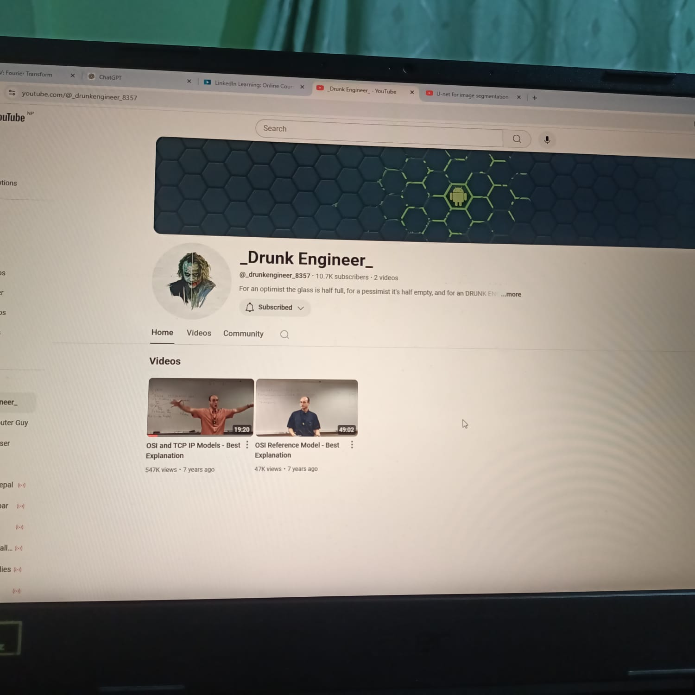
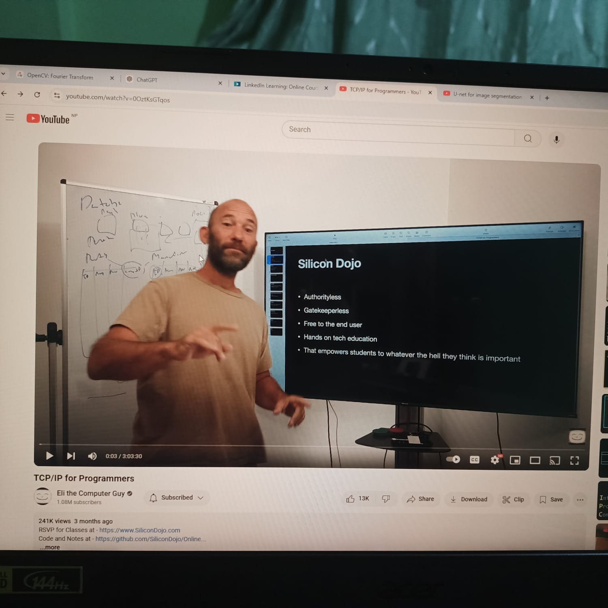
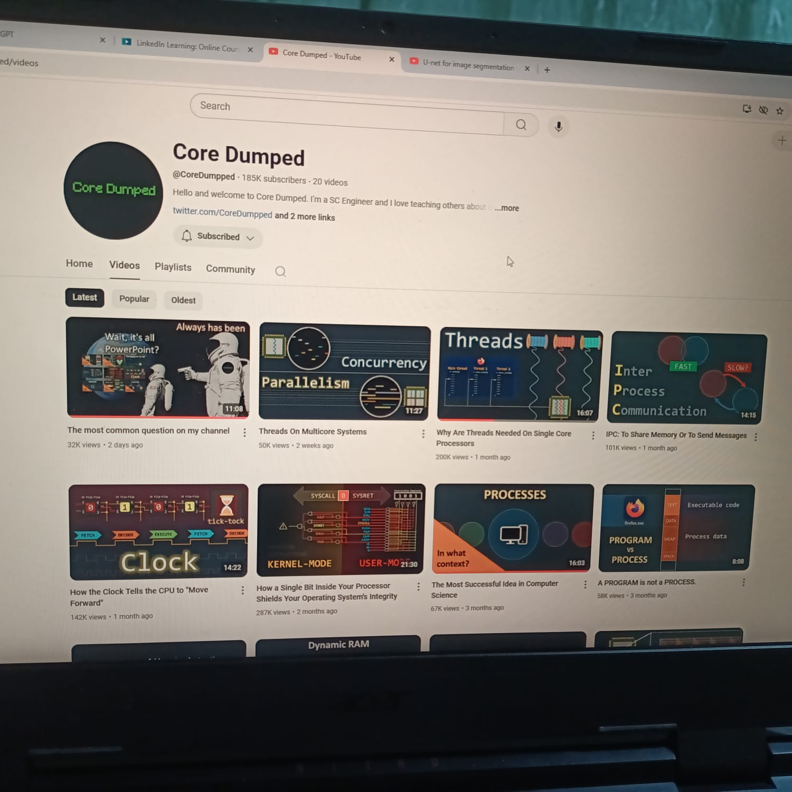
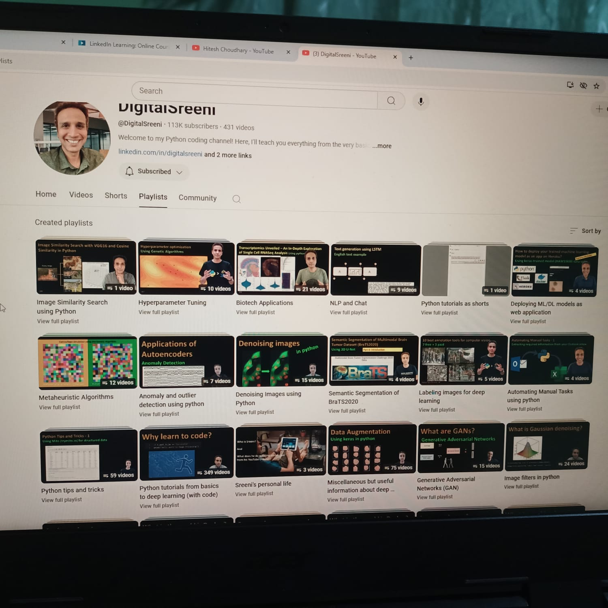

[Best Back Propagation(Video Visualization Resource)](https://www.youtube.com/watch?v=SmZmBKc7Lrs&list=PLgtmMKe4spCPsxyMpg-sxf3EcbsFYlzPK)

[Best Video Visualization Tech](https://www.youtube.com/@CoreDumpped/videos) : Core Dump uses PowerPoint to create such video

[Mathematics Visualization](https://www.youtube.com/@3blue1brown)

[How to Edit Videos Like - Artem Kirsanov](https://www.youtube.com/watch?v=yaa13eehgzo) : He uses variety of tools like Python, Blender, Adobe Ecosystem

[GFX Mentor](https://www.youtube.com/@GFXMentor) : Best tutorials for Editing

[GFX Mentor After Effects](https://www.youtube.com/playlist?list=PLW-zSkCnZ-gD8OcjTPu-u_Rxl9-kI9Xqr)

